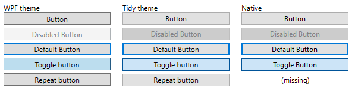

# Tidy
WPF utility library containing proper Windows 10 controls theme, performance oriented custom controls and MVVM essentials

---

## Mvvm utitilies ##

Essential Mvvm utility classes `ViewModelBase` and `RelayCommand` are included in `Tidy.Mvvm` namespace to eliminate the need of linking heavier Mvvm frameworks for basic apps. 

### Relay command ###

`RelayCommand` and `RelayCommand<T>` helper classes support execution of simple actions in sync and async manner.

### ViewModelBase ###

Basic implementation of `INotifyPropertyChanged` interface with standard `RaisePropertyChanged` and `SetField<T>` helper methods.

---

## Control themes ##

WPF's default theme on Windows 10 is subtly different from system chrome, and is less polished. This library tries to bring WPF's default controls as close to system chrome look as possible.

All comparisons can be viewed side by running included `Tidy.Showcase` application.

### Button themes ###

## Custom controls ##

---

### Data controls ###

Reimplementations of standard WPF data controls focused on highest performance possible in order to faciliate rendering of millions of items.

Planned controls include

- ListBox
- TreeView
- ListView
- DataGrid

---

## Changelog ##

### alpha 1 ###
- Mvvm utility classes `ViewModelBase` and `RelayCommand`

---

## Roadmap ##

### alpha 2 ###
- Fixed default themes for existing controls that have different styles than Windows 10 native controls (for now without animation support):
  - Button
  - TextBox
  - ComboBox
  - ComboBox

### version 1 ###

- Control themes
  - Enable animations for standard controls 
  - High contrast support
  - Accessiblity/Screen reader support

  

